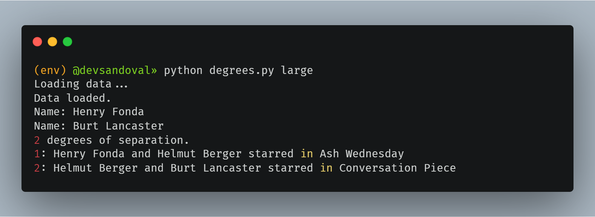

# 🎬 Degrees of Separation in Hollywood 🎭

[](https://www.python.org/)
[](https://en.wikipedia.org/wiki/Breadth-first_search)
[](https://opensource.org/licenses/MIT)

## 🌐 Idioma / Language

-   [🇺🇸 English](README.en.md)
-   🇪🇸 Español (Actual)

## 📝 Descripción

Este proyecto implementa el famoso concepto de **"Seis Grados de Separación"** (o "Six Degrees of Kevin Bacon") aplicado al mundo del cine. La aplicación encuentra la ruta más corta que conecta a dos actores a través de películas en las que han participado.

La teoría sugiere que cualquier actor puede ser conectado a Kevin Bacon (o a cualquier otro actor) en seis pasos o menos.

## 🚀 Características

-   🔍 Búsqueda por nombre de actores
-   🧮 Implementa un algoritmo de búsqueda BFS (Breadth-First Search)
-   📊 Soporte para conjuntos de datos pequeños y grandes
-   🎯 Resolución de ambigüedades de nombres
-   📋 Muestra la cadena completa de conexiones entre actores

## 🖼️ Ejemplo



_La imagen muestra un ejemplo de ejecución del programa donde se encuentra la conexión entre dos actores._

## 🛠️ Cómo funciona

El algoritmo utiliza una estructura de datos de grafo donde:

-   Los **nodos** son actores
-   Las **aristas** son películas en las que dos actores han trabajado juntos

Para encontrar la conexión más corta, el programa:

1. Carga los datos de actores y películas desde archivos CSV
2. Implementa un algoritmo de búsqueda BFS (Breadth-First Search)
3. Construye y muestra el camino más corto entre los dos actores

## 📦 Estructura de datos

El programa maneja tres estructuras de datos principales:

-   `names`: Mapea nombres a conjuntos de IDs de personas
-   `people`: Mapea IDs de personas a diccionarios con su nombre, año de nacimiento y películas
-   `movies`: Mapea IDs de películas a diccionarios con título, año y actores

## 💻 Uso

```bash
python degrees.py [directorio]
```

Donde `[directorio]` es opcional y puede ser:

-   `small` para usar un conjunto de datos reducido (predeterminado)
-   `large` para usar un conjunto de datos completo

## 🧩 Ejemplo de Interacción

```
Loading data...
Data loaded.
Name: Emma Watson
Name: Kevin Bacon
2 degrees of separation.
1: Emma Watson and Actor X starred in Movie A
2: Actor X and Kevin Bacon starred in Movie B
```

## 🧠 Algoritmo

El núcleo del proyecto es la función `shortest_path` que implementa un algoritmo BFS para encontrar la ruta más corta entre dos actores. Este algoritmo garantiza encontrar el camino con el menor número de conexiones.

## 📊 Conjuntos de Datos

-   **small**: Un conjunto reducido de actores y películas para pruebas rápidas
-   **large**: Una base de datos más completa del mundo cinematográfico

## 🤝 Contribuir

¡Las contribuciones son bienvenidas! Puedes mejorar el algoritmo, optimizar el código o ampliar la base de datos.

## 📜 Licencia

Este proyecto está bajo la Licencia MIT.

---
## 👨‍💻 Autor

### [David Sandoval](https://github.com/sandovaldavid)

-   🌐 Portafolio: [devsandoval.me](https://devsandoval.me)
-   💼 LinkedIn: [@devsandoval](https://linkedin.com/in/devsandoval)
-   💻 GitHub: [@sandovaldavid](https://github.com/sandovaldavid)
-   📧 Email: [contact@devsandoval.me](mailto:contact@devsandoval.me)

---

⭐ **Proyecto inspirado en el concepto de "Six Degrees of Kevin Bacon"** ⭐

---

<div align="center">
  <p>
    <small>Desarrollado como parte del curso <span style="font-weight: bold;">CS50's Introduction to Artificial Intelligence with Python</span> en Edx - 2024</small>
  </p>
  
</div>
